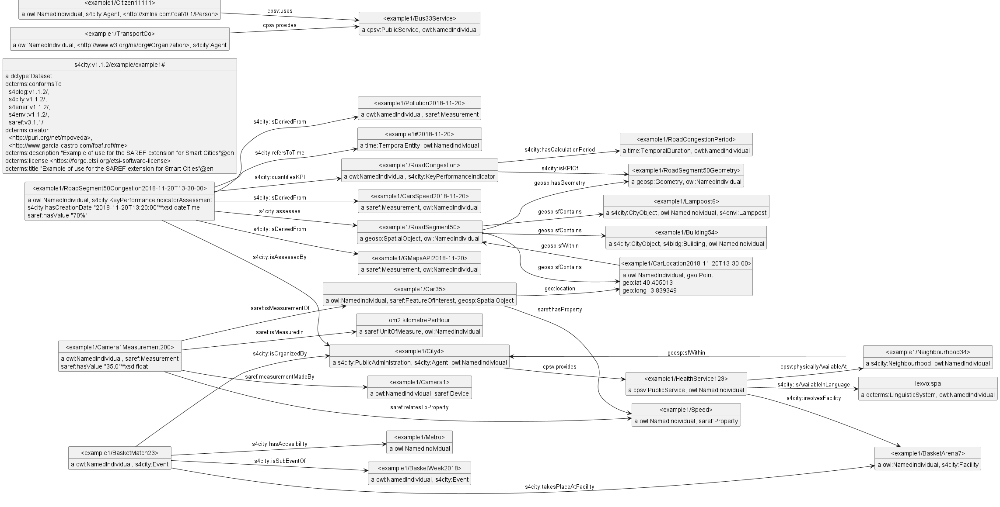

# saref4city Example Diagram with `rdfpuml`

- Get the example from https://labs.etsi.org/rep/saref/saref4city/-/tree/develop-v1.1.2/examples and save as `example1-saref4city.ttl`
- Copy the prefixes to `prefixes.ttl` (my tool looks for prefixes there, need to change that)
- Add the following prefixes, which are missing in the example (so full URLs would be shown)
```ttl
@prefix s4ener: <https://saref.etsi.org/saref4ener/> .
@prefix s4bldg: <https://saref.etsi.org/saref4bldg/> .
@prefix lexvo: <http://lexvo.org/id/iso639-3/> .
@prefix om2: <http://www.ontology-of-units-of-measure.org/resource/om-2/>.
@prefix geosp: <http://www.opengis.net/ont/geosparql#>.
@prefix cpsv: <http://purl.org/vocab/cpsv#>.
@prefix puml: <http://plantuml.com/ontology#> .
```
- Change the base to the one actually used for example individuals:
```ttl
@base <https://saref.etsi.org/saref4city/data/city/>.
```
- Add the following PlantUML instructions to the Turtle
  - `left to right direction` is needed because:
    - Each node has type `owl:NamedIndividual` (amongst business-useful classes), which makes them pretty wide
    - There are disconnected parts of the diagram, that are placed consecutively on the right
  - `puml:InlineProperty` is needed to display example metadata inlined, not as separate nodes

```ttl
[] puml:options """
  hide empty members
  hide circle
  left to right direction
""".
dcterms:creator    a puml:InlineProperty.
dcterms:license    a puml:InlineProperty.
dcterms:conformsTo a puml:InlineProperty.
```

## Installing
Do this once, then just run `make`:

- Install `rdfpuml` from https://github.com/VladimirAlexiev/rdf2rml and add its `bin` folder to your path
- Install `plantuml.jar` from https://plantuml.com/download to eg `c:\prog\plantuml`
- Run `rdfpuml` to generate a `.puml` file:
```
perl -S rdfpuml.pl example1-saref4city.ttl
```
- Run `plantuml` to generate the diagram:
```
java -jar c:\prog\plantuml\plantuml.jar -charset UTF-8 example1-saref4city.puml
```

## Diagram With GraphViz Layout

PlantUML normally uses the external program graphviz `dot` to make the layout:


## Diagram With Smetana Layout

Let's try with the [smetana](https://plantuml.com/smetana02) layouter, which is a reimplemetation of graphviz to Java.
You can invoke it in two ways:

- `!pragma layout smetana` in the puml file
- `-Playout=smetana` on the command line

As you can see, the result is almost the same:


