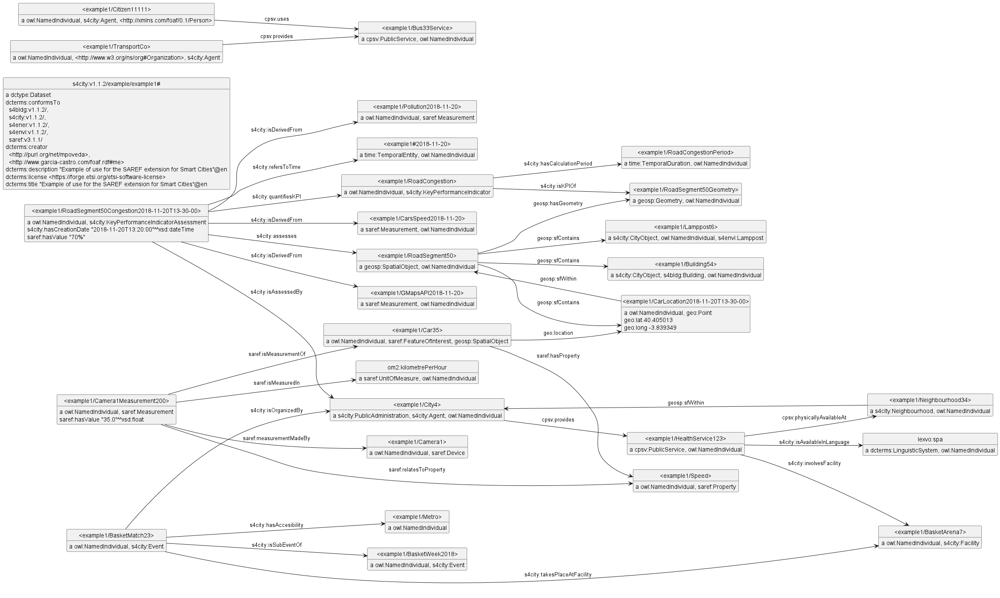

# saref4city Example Diagram with `rdfpuml`

- Install `rdfpuml` from https://github.com/VladimirAlexiev/rdf2rml and add its `bin` folder to your path
- Install `plantuml.jar` from https://plantuml.com/download to eg `c:\prog\plantuml`
- Get the example from https://labs.etsi.org/rep/saref/saref4city/-/tree/develop-v1.1.2/examples and save as `example1-saref4city.ttl`
- Copy the prefixes to `prefixes.ttl` (my tool looks for prefixes there, need to change that)
- Add the following prefixes, which are missing in the example (full URLs are used instead)
```ttl
@prefix s4ener: <https://saref.etsi.org/saref4ener/> .
@prefix s4bldg: <https://saref.etsi.org/saref4bldg/> .
@prefix lexvo: <http://lexvo.org/id/iso639-3/> .
@prefix om2: <http://www.ontology-of-units-of-measure.org/resource/om-2/>.
@prefix geosp: <http://www.opengis.net/ont/geosparql#>.
@prefix cpsv: <http://purl.org/vocab/cpsv#>.
@prefix puml: <http://plantuml.com/ontology#> .
```
- Change the base to the one actually used for example individuals:
```ttl
@base <https://saref.etsi.org/saref4city/data/city/>.
```

- Add the following PlantUML instructions (to display example metadata inlined, not as separate nodes):
```ttl
dcterms:creator    a puml:InlineProperty.
dcterms:license    a puml:InlineProperty.
dcterms:conformsTo a puml:InlineProperty.
```

- Run `rdfpuml` to generate a `.puml` file:
```
perl -S rdfpuml.pl example1-saref4city.ttl
```
- Edit this file to add `left to right direction` as second line:
```puml
@startuml
left to right direction
```
- Run `plantuml` to generate the diagram:
```
java -jar c:\prog\plantuml\plantuml.jar -charset UTF-8 example1-saref4city.puml
```

## Diagram



## Why the Rigmarole?

Why did we have to do the complicated steps described above?
It's to shorten URLs and have a more compact diagram:

- Some prefixes had to be added because they are missing from the example
- Base had to be changed to the actual one used for example individuals
- `left to right direction` is needed because:
  - Each node has type `owl:NamedIndividual` (amongst business-useful classes), which makes them pretty wide
  - There are disconnected parts of the diagram, that are placed consecutively on the right
  - AFAIK, there's no way to pass this parameter on the command line, so I asked: https://forum.plantuml.net/17002/how-to-set-left-to-right-direction-from-command-line
  - TODO: add an option to my tool
